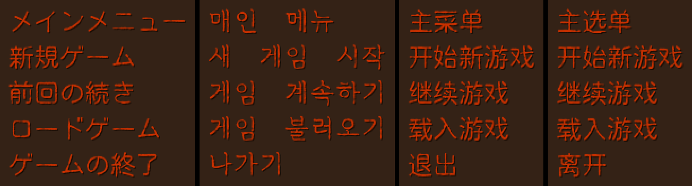

# FXScuffy

This repo [provides several fonts](./fonts/) intended for use in the [KeeperFX project](https://github.com/dkfans/keeperfx/). The source code for producing these fonts is also present.

These fonts use several permissively-licensed fonts as a base:
- Kosugi Maru
- Gowun Batang
- ResourceHanRounded

The scuffing is algorithmic and based on the menu font used in *Dungeon Keeper Premium*, which is ＤＦＰ康印体W4 (specifically the 1996 2.0 release), by DynaLab. Although inspired by that font, FXScuffy is not a derivate work, but rather a permissively licensed alternative based on the permissive fonts listed above.

### License

The `KOR`, `CHI`, and `CHT` variants are available under the SIL Open Font 1.1 license. The `JPN` variant is available under the Apache 2.0 license. See the [fonts directory](./fonts/) for details.
